# Computational experiments

Twelve short scripts that watch the constructions of **An operator-theoretic
representation of the Weil quadratic form** (Paper I) at work on small, concrete
inputs. Each script works through one example, printing what it found and what
that means and drawing figures that say what to look for. Where it can, it
computes the same object two independent ways.

The scripts illustrate the paper; they do not prove anything. The
[status labels](#how-to-read-the-results) say which kind of claim each
experiment supports.

```sh
uv sync --locked                                  # once
uv run --locked python run_all.py                 # all eleven float64 demos, about 20 s
uv run --locked python experiment_06_boundary_leakage.py
uv run --locked python experiment_09_finite_characteristic.py --precision mp50
```

**Contents** · [How to read the results](#how-to-read-the-results) ·
[The experiments](#the-experiments) · [Where the numerical error comes from](#where-the-numerical-error-comes-from) ·
[Precision ladder](#precision-ladder) · [Notebooks](#editable-marimo-playgrounds) ·
[Reproduction and provenance](#reproduction-and-provenance)

| # | Experiment | Paper I | Status |
|---|---|---|---|
| 1 | [Integer multiplication as logarithmic translation](#1-integer-multiplication-as-logarithmic-translation) | §2.1 | identity check |
| 2 | [Finite Euler synthesis, Möbius inverse, prime current](#2-finite-euler-synthesis-möbius-inverse-prime-current) | Prop. 2 | identity check |
| 3 | [The absorbing generator and its resolvent](#3-the-absorbing-generator-and-its-resolvent) | §2.2 | theorem visualization |
| 4 | [The completed critical kernel](#4-the-completed-critical-kernel) | Thm. 1 | theorem visualization |
| 5 | [The nonclosability witness](#5-the-nonclosability-witness) | §3.1 | theorem visualization |
| 6 | [Boundary leakage and the leakage derivative](#6-boundary-leakage-and-the-leakage-derivative) | Thm. 5, Thm. 7 | theorem visualization |
| 7 | [The finite Weil matrix, two ways](#7-the-finite-weil-matrix-two-ways) | Thm. 9 | identity check |
| 8 | [Selecting the ground state](#8-selecting-the-ground-state) | §5, Lemma 10 | finite diagnostic |
| 9 | [The finite boundary characteristic](#9-the-finite-boundary-characteristic) | Thm. 12, Prop. 11 | identity check |
| 10 | [The completed range versus its projection](#10-the-completed-range-versus-its-projection) | Prop. 13, §6 | theorem visualization |
| 11 | [A small predetermined moving family](#11-a-small-predetermined-moving-family) | §6, Prop. 14 | exploratory |
| 12 | [The precision ladder](#12-the-precision-ladder) | — | method diagnostic |

## How to read the results

Every figure has the same three layers of text:

- the **headline** states what the figure shows;
- the **subtitle** gives the formula being drawn and the measured numbers;
- the **footnote** names the result in Paper I and the status of the calculation.

Every script prints the same three blocks: the **claim** being examined, the
original numerical diagnostics, and a **reading** that interprets them, including
where any discrepancy comes from.

The status labels are deliberately different kinds of evidence:

- **Numerical check of an exact finite identity.** Both sides are finite
  computations that the paper proves equal. Floating-point agreement illustrates
  the algebra; it is not an exact-arithmetic certificate.
- **Theorem visualization.** The analytic theorem is proved in the paper; the
  script shows a discretized instance of it.
- **Finite diagnostic.** A statement about one chosen carrier `(x, N)`.
- **Exploratory moving experiment.** Finite data along a predetermined family,
  with no compactness or convergence conclusion.

Numerical agreement is not a substitute for the analytic arguments or for the
open moving-limit mathematics.

## The experiments

### 1. Integer multiplication as logarithmic translation

*§2.1 · numerical check of an exact finite identity*

On `L²(0, L)` the killed shift `S_y f(t) = f(t + y)` drops whatever leaves the
interval. Writing `V_n = S_{log n}` turns multiplication of integers into
composition of shifts, `V_m V_n = V_{mn}`, with `V_n = 0` once `n ≥ x = e^L`.
The script shifts a profile by `log 2` and then by `log 3`, and compares the
result with a single shift by `log 6`.

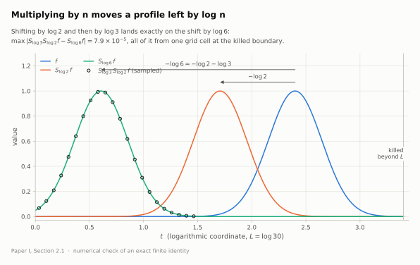

The two routes differ by `7.9e-5`, and all of that sits in the one grid cell at
the killed boundary: the profile is `2.8e-4`, not zero, at `t = L`, so killing it
leaves a jump that linear interpolation smears. Everywhere else the difference is
`1.3e-5`, ordinary interpolation error on this grid.

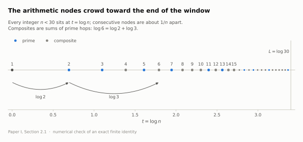

### 2. Finite Euler synthesis, Möbius inverse, prime current

*Proposition 2 · numerical check of an exact finite identity*

Because `V_n` vanishes for `n ≥ x`, every Euler factor is a terminating
geometric series and the product is finite. The script multiplies elements of
the shift algebra, stored as `{n: coefficient of V_n}`, and checks all three
lines of eq. (10) at `x = 30`, `s = 0.75 + 0.2i`. All three hold to `1.7e-16`.

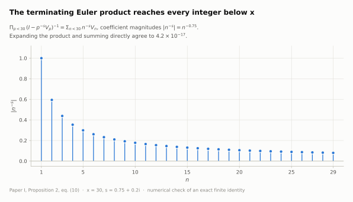

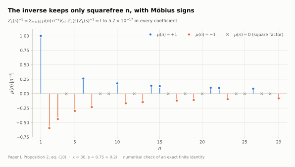

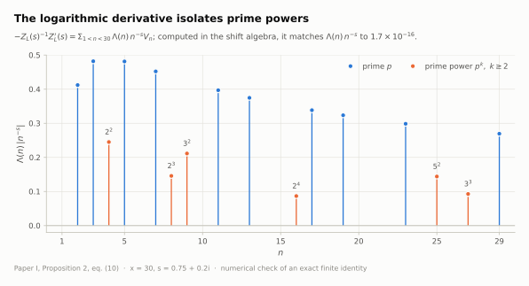

### 3. The absorbing generator and its resolvent

*§2.2, eqs. (11)–(12) · theorem visualization*

The generator `A_L f = f'` carries the boundary condition `f(L) = 0`, and its
resolvent integrates back from that endpoint. The script checks
`(b − A_L) R_b f = f` with a finite-difference derivative.

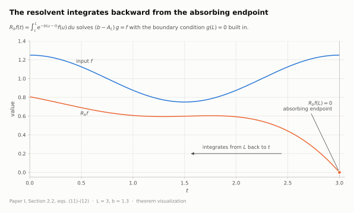

The interior residual `1.3e-6` is second-order discretization error: it drops
fourfold each time the grid is doubled. The first and last five samples use
first-order one-sided differences, which is why the check excludes them.

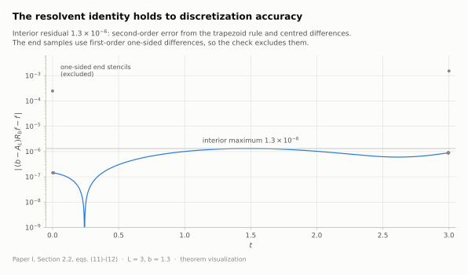

### 4. The completed critical kernel

*Theorem 1, eqs. (7), (40), (42) · theorem visualization*

Completing the critical Euler synthesis with its Γ and polar factors gives
convolution with an explicit kernel,
`K(y) = π e^{−5y/2} m(m+1)(1 − 2θ)`, `m = ⌊e^y⌋`, `θ = e^y − m`. Its absolute
integral is at most `8π/3`, so the completed operator is bounded even though
the raw one is not closable (Experiment 5).

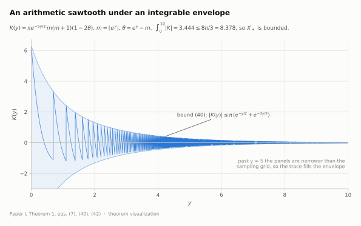

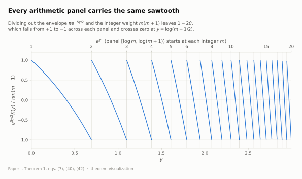

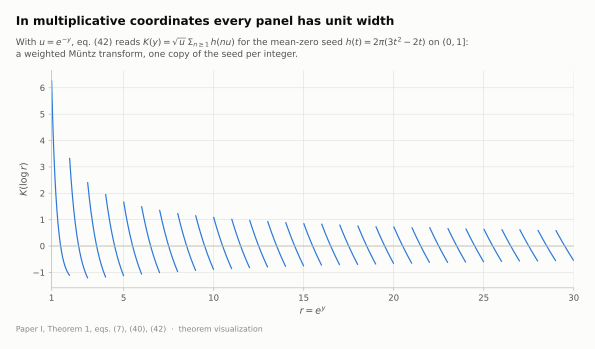

The float64 `L¹` value `3.4441` is a trapezoid sum on 12,000 samples. `[0, 10]`
contains 22,026 arithmetic panels, so only its first three or four digits are
reliable. `--precision mp50` integrates each panel exactly with the closed
antiderivative and gives `3.44354`.

### 5. The nonclosability witness

*§3.1, eqs. (43)–(47) · theorem visualization*

The inputs `f_T = e^{−T/2} 1_[T, T+d]` shrink to zero, yet the raw critical
synthesis `Z₊(½) f_T` converges to `g(t) = 2(e^{d/2} − 1) e^{−t/2} ≠ 0`, so
`Z₊(½)` has no closed extension. Completion kills exactly this defect.

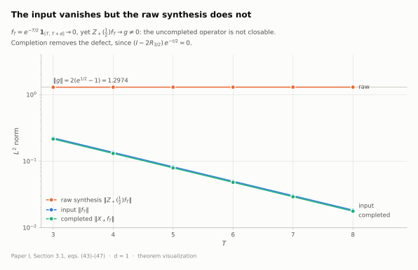

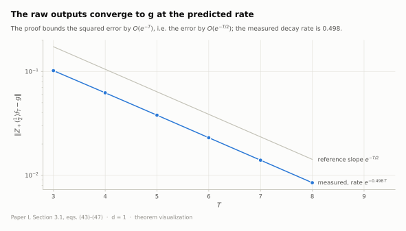

### 6. Boundary leakage and the leakage derivative

*Theorem 5, eq. (63); Theorem 7, eq. (76) · theorem visualization*

The central identity of Paper I. Extend a source on `(0, L)` by zero and apply
the full-line completed operator: part of the output stays in the window and
part escapes to the left. The full-line energy is stationary at `s = ½`, so the
two parts have opposite `s`-derivatives, and the localized Weil form of the
completed output equals the derivative of the retained energy.

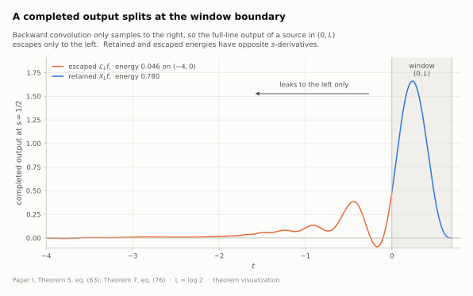

The script computes the two sides by different discretizations: a finite
difference of the factorized family `X_L(s)` and direct quadrature of eq. (76).
At the default resolution they differ by `1.2e-4` (0.7 %). The refinement ladder
shows that this gap is discretization error. It halves with every doubling of
resolution, down to `2.9e-5` at 4×. The first-order term comes from midpoint
quadrature of the Γ factor, whose `s`-derivative has a logarithmic singularity at
`y = 0` (§2.2).

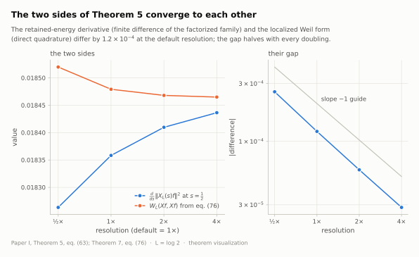

### 7. The finite Weil matrix, two ways

*Theorem 9, eq. (94); Theorem 7, eq. (76) · numerical check of an exact finite identity*

In the Fourier basis `U_j = L^{−1/2} e^{iω_j t}`, `|j| ≤ N`, the localized form is
a matrix of divided differences of one real odd function plus a Γ multiplier on
the diagonal. The script builds it from this formula and, independently, by
integrating eq. (76) against every pair of modes (`x = 13`, `N = 4`).

<p>
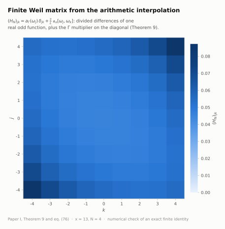

</p>

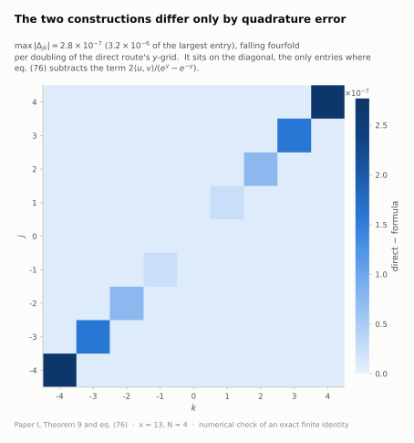

The routes agree to `2.8e-7`, about `3e-6` of the largest entry. The error
belongs to the direct route's quadrature. It falls fourfold per doubling of that
route's `y`-grid, and it sits on the diagonal, the only entries where eq. (76)
subtracts its singular term.

### 8. Selecting the ground state

*§5, Lemma 10 · finite diagnostic*

When the least eigenvalue of `H_N` is simple with an eigenvector even under
`t ↦ L − t`, that eigenvector cannot vanish at the endpoint, so it normalizes
uniquely to `ξ_N(0) = 1`. For `x = 2`, `N = 4`: `ε_N = 1.74e-3`, next gap
`0.1035`, parity error `1.4e-15`, unit endpoint value `0.1333`.

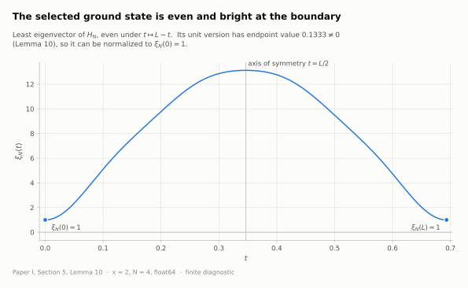

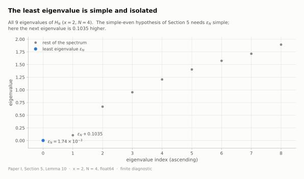

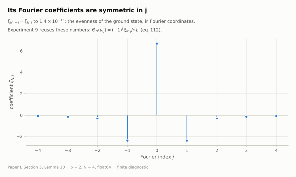

### 9. The finite boundary characteristic

*Theorem 12, eqs. (9), (111)–(112); Proposition 11 · numerical check of an exact finite identity*

The determinant ratio `sinc(Lz/2) det(D′_N − z)/det(D_N − z)` equals the Fourier
transform of the selected ground state divided by `L`. The corrected derivative
`D′_N` is self-adjoint for a positive metric, so every zero is real. The two
formulas agree to `5.4e-14` at five off-axis points (`6.4e-50` at mp50).

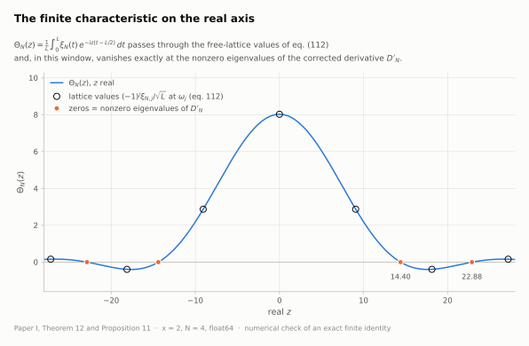

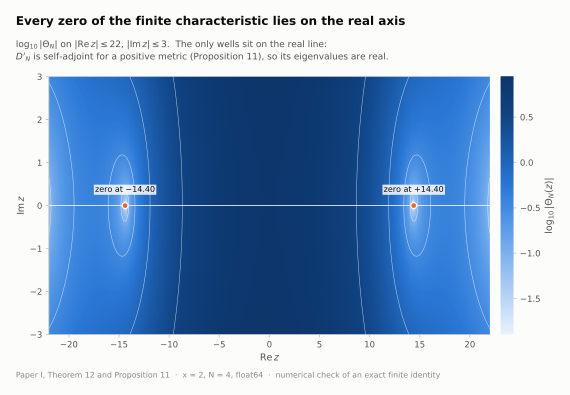

`D′_N ξ_N = 0`, so `0` is always an eigenvalue of `D′_N`. In the determinant
ratio it cancels against the free lattice point `ω₀ = 0`, and indeed
`Θ_N(0) = 8.02`. The other eigenvalues, `±14.40, ±22.88, ±31.77, ±43.85`, are
zeros of `Θ_N`. So are the lattice points `ω_j` with `|j| > N`.

### 10. The completed range versus its projection

*eq. (28), Proposition 13, §6 · theorem visualization*

The completed range is `{f ∈ H¹ : f(L) = 0}`. Periodic Fourier polynomials have
`f(L) = f(0)`, so the endpoint-bright ground state lies outside the range. Even
so, tapering each Fourier mode to zero at `L` and projecting back gives all of
`E_N`: the nine projected modes have rank 9 and smallest singular value `0.389`.

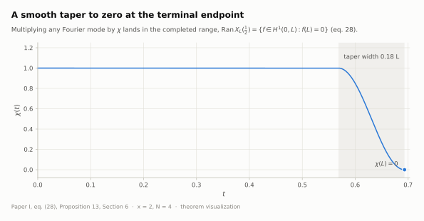

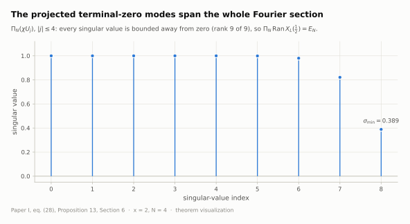

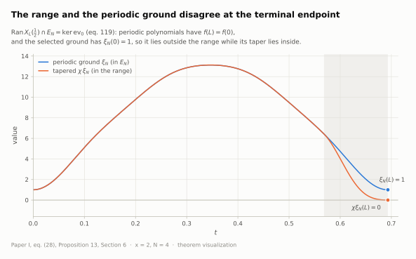

### 11. A small predetermined moving family

*§6, Proposition 14 · exploratory moving experiment*

The open moving question asks whether normalized characteristics along an
unbounded family converge to a nonzero entire limit that keeps every zero of `Ξ`.
This script only records seven fixed carriers, `1.5 ≤ x ≤ 3`. Every one of them
satisfies the simple-even hypothesis. The script draws no conclusion about the
limit. Full-precision values go to `moving_family_diagnostics.csv`.

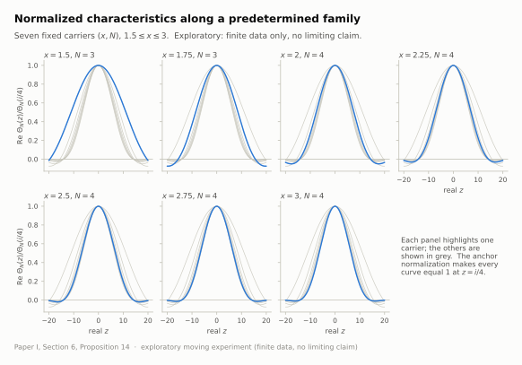

<p>
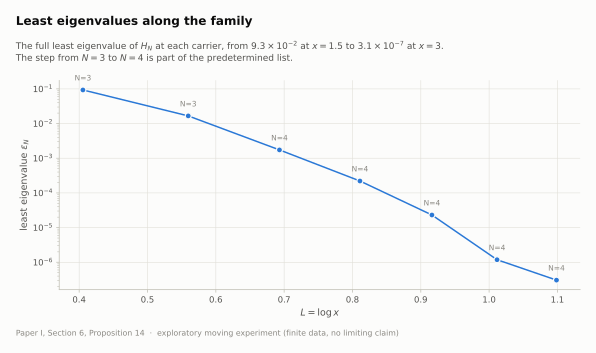
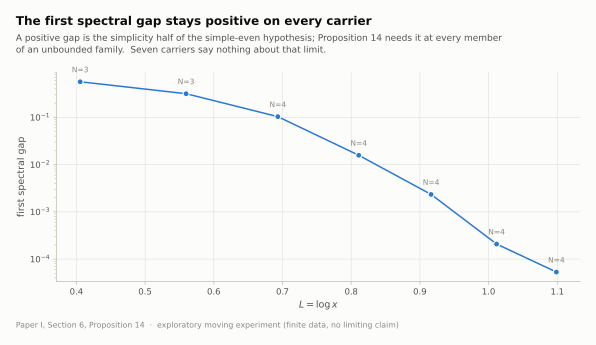
</p>

### 12. The precision ladder

*method diagnostic*

This repeats Experiments 8 and 9 at float64 and at 50, 100 and 200 digits
(`run_all.py --include-precision-ladder`). Every mpmath row agrees to all
displayed digits, and float64 agrees with them to at least eleven significant
digits. For these carriers double precision is ample.

## Where the numerical error comes from

Almost every visible discrepancy in the suite is **discretization** error, which
more digits cannot remove. Each script's reading says which grid is responsible.

| Exp. | Measured gap | Source | Under refinement |
|---|---|---|---|
| 1 | `7.9e-5` | one interpolation cell at the killed boundary | does not converge smoothly; `1.3e-5` elsewhere |
| 3 | `1.3e-6` | trapezoid rule and centred differences | second order (÷4 per doubling) |
| 4 | fourth digit of `3.4441` | trapezoid sum across 22,026 panels | exact with `--precision mp50` |
| 6 | `1.2e-4` | midpoint rule on the log-singular Γ derivative | first order (÷2 per doubling) |
| 7 | `2.8e-7` | midpoint rule in the direct route, diagonal only | second order (÷4 per doubling) |
| 2 | `1.7e-16` | floating-point rounding | exact algebra; no precision option needed |
| 9 | `5.4e-14` | floating-point rounding | `6.4e-50` at `--precision mp50` |

## Precision ladder

The default is ordinary double precision. Experiments 4, 7, 8, 9 and 11 accept
a higher-precision profile for their core calculation; figures are always drawn
in float64.

```text
float64  -> fast NumPy calculation and all plots
mp50     -> 50 decimal digits
mp100    -> 100 decimal digits
mp200    -> 200 decimal digits
```

```sh
uv run --locked python experiment_08_ground_selection.py --precision mp50
uv run --locked python experiment_07_fourier_matrix.py --dps 80
```

A custom `--dps N` overrides the named profile. `precision.py` holds the
profiles and `high_precision.py` holds readable mpmath versions of the delicate
formulas. The float64 implementation stays in `common.py`. The duplication is
intentional: the two versions are easier to audit side by side than a generic
numerical backend.

Higher precision pays off where the code keeps structure exact rather than
asking for more digits. Arithmetic support is decided with integer logic. The
kernel is integrated between its `log n` thresholds. Prime, continuum and Γ
pieces are assembled explicitly. The characteristic is evaluated as an entire
Fourier transform, and the determinant formula is used only as an independent
check away from the free lattice.

`mpmath` gives arbitrary precision, not proof-certified interval arithmetic.
Proof-grade bounds would belong in a separate Arb/python-flint package.

## Editable marimo playgrounds

[The notebook guide](notebooks/README.md) has one playground per experiment.
Their cells expose the calculations and editable copies of the numerical methods.
Plots render inline and do not overwrite the scripts' figures.

```sh
uv sync --locked --group notebooks
uv run --locked --group notebooks marimo edit experiments/notebooks/playground_04_completed_kernel.py
```

## Reproduction and provenance

```sh
uv run --locked python smoke_test.py
uv run --locked python run_all.py
uv run --locked python run_all.py --include-precision-ladder
```

`run_all.py` regenerates every figure in `figures/`. The SVGs are deterministic:
fixed element ids, no timestamp, glyphs stored as paths. Rerunning therefore
reproduces them byte for byte on the pinned environment. `presentation.py` holds
the shared figure style and console layout. It computes no mathematics.

The numerical code descends from a precision-ladder archive described in
[PROVENANCE.md](PROVENANCE.md). The scripts' presentation has since been revised
while their calculations are unchanged, and that file records how this was
verified. `source-hashes.json` records the current reviewed hash of every Python
file. Equation numbers inside `common.py` and `high_precision.py` follow the
archived manuscript draft; the scripts, figures and this guide use Paper I's
numbering.

[uv](https://docs.astral.sh/uv/getting-started/installation/) manages the
environment from the repository-root `pyproject.toml` and `uv.lock` (Python
3.10 by default, 3.10–3.13 supported). The only runtime dependencies are NumPy,
Matplotlib and mpmath. For a pip workflow,
`python -m pip install -r requirements-lock.txt` remains available. The
requirements files are compatibility snapshots.
